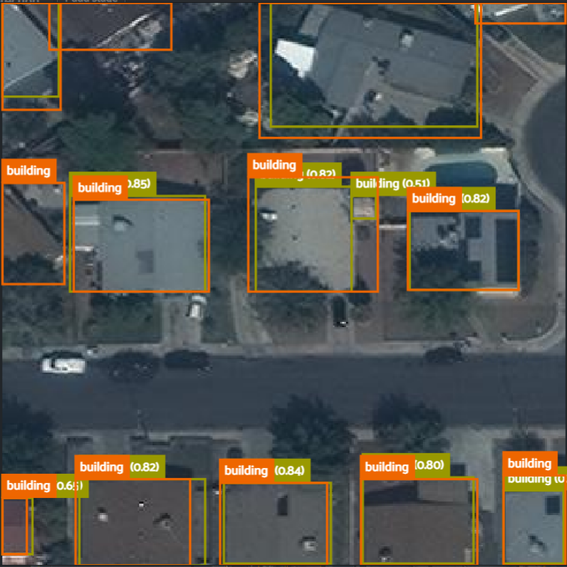

# Object detection on Satellite Imagery

• Using the IceVision library for object detection, I built an object detector to detect buildings from the AICrowd Mapping Challenge dataset.

• Ultralytics YOLOv5, pretrained on the COCO dataset, obtained a COCO metric of 57%, despite this dataset being dissimilar to COCO.

• The model recalled 76% of the bounding boxes with a precision of 85%.

See below for an inference example.



The notebooks in this repository can be run in Google Colab or Paperspace, and the instructions shall be described below.

## Installation

First download and decompress the Mapping Challenge data from [here](https://www.aicrowd.com/challenges/mapping-challenge) into the "data" folder.

The notebooks in this repo can be run after installing IceVision in a bash environment:

```bash
# # Torch - Torchvision - IceVision - IceData - MMDetection - YOLOv5 - EfficientDet Installation
wget https://raw.githubusercontent.com/airctic/icevision/master/icevision_install.sh

# # Choose your installation target: cuda11 or cuda10 or cpu
source icevision_install.sh cuda11 master
```

They've been tested on Google Colab and the Paperspace Pytorch image on July 2022.

## Workflow

Once the dataset is downloaded, and IceVision is installed. 

1. Preprocess annotations-small.json so that it works well with IceVision by running the following line:

```bash
python mappingchallenge/preprocess-annotations.py data/train annotation-small.json annotation-small3.json
```

For testing purposes we will use the validation set, so replace "data/train" with "data/val" above.

2. Create a cache of the IceVision records, since parsing 8000 images takes some time:

```bash
python mappingchallenge/cache-records.py data/train annotation-small3.json cache-records3.p
```

For testing purposes we will use the validation set, so replace "data/train" with "data/val" above.

3. Configure and train models in "notebooks/wandb-building-detection.ipynb". Ideally you'll need a Weights & Biases (wandb)
   account to get this working.

4. Analyze model performance using the notebook "notebooks/inference-building-detection.ipynb".

This can be done without training a model by unzipping the model in the models folder.
